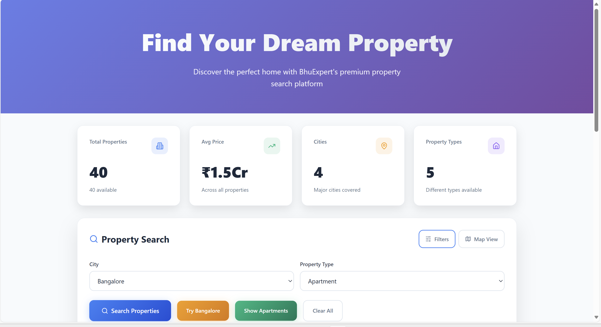
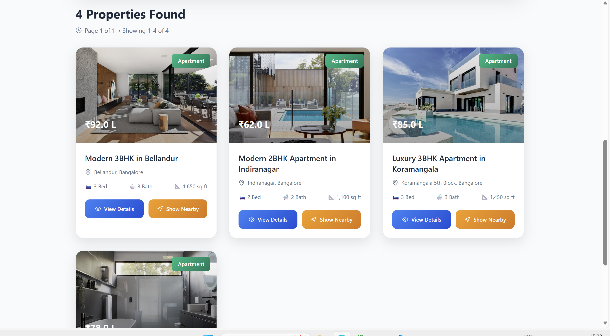
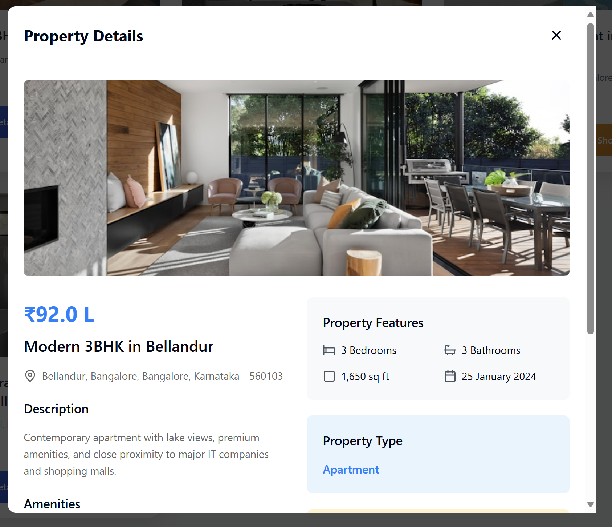
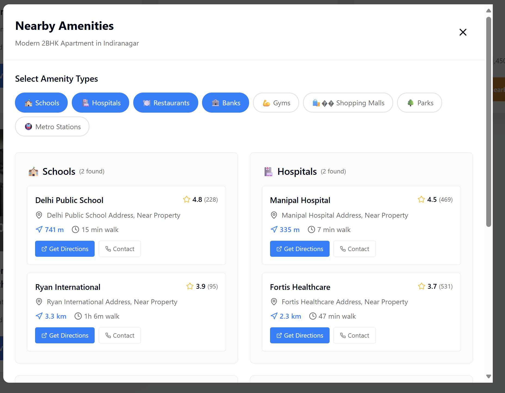
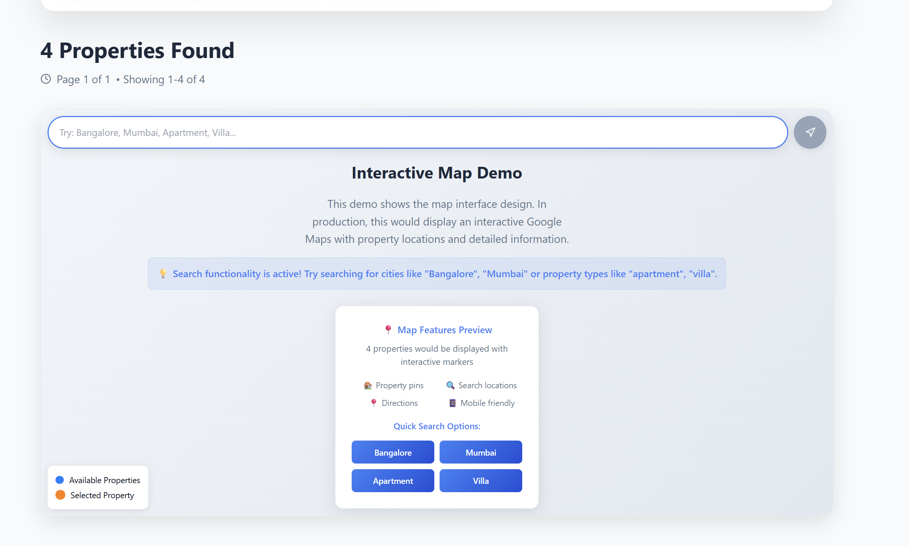
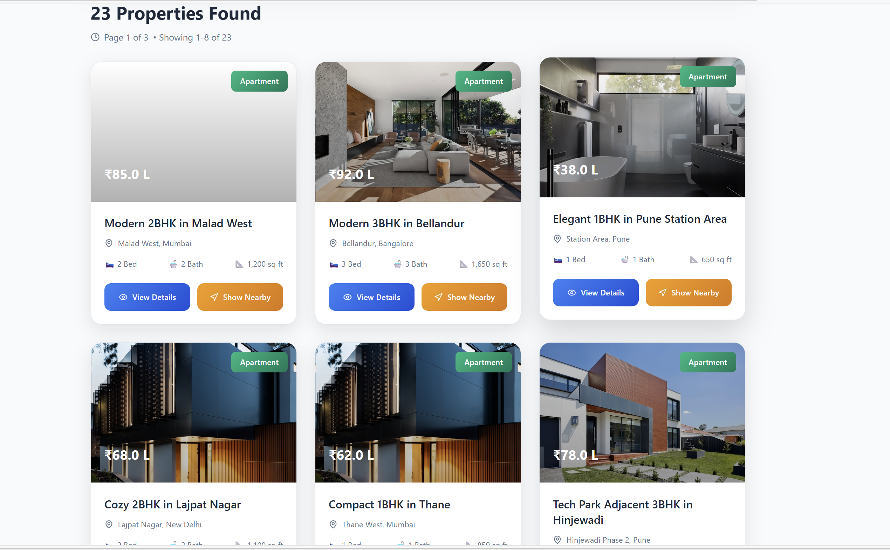

# BhuExpert - Real Estate Property Search Platform

A comprehensive full-stack property search application built for BhuExpert's coding interview challenge.

## 🏗️ Architecture Overview

### Tech Stack
- **Frontend**: React 18 + TypeScript + Vite + TailwindCSS
- **Backend**: Express.js + TypeScript
- **Database**: Mock data (MongoDB structure ready)
- **Maps Integration**: Google Maps API (mock implementation)
- **Styling**: TailwindCSS with custom BhuExpert branding

### Project Structure
```
├── client/                 # React frontend
│   ├── components/         # Reusable UI components
│   ├── pages/             # Route components
│   ├── App.tsx            # Main app component
│   └── global.css         # TailwindCSS + branding
├── server/                # Express backend
│   ├── routes/           # API route handlers
│   ├── services/         # Business logic services
│   ├── data/            # Mock data
│   └── index.ts         # Server configuration
├── shared/               # Shared TypeScript interfaces
└── README.md            # This file
```

## ✨ Features Implemented

### Frontend Features
- **🎨 Modern BhuExpert Branding**: Custom blue-to-orange gradient theme
- **📊 Real-time Statistics Dashboard**: Property metrics display
- **🔍 Advanced Property Search**: Multi-criteria filtering
- **📱 Responsive Design**: Mobile-first approach
- **🏠 Property Grid Display**: Card-based property listings
- **⚡ Loading States**: User feedback during operations
- **🚫 Error Handling**: Graceful error management
- **🎯 Interactive UI**: Hover effects and smooth transitions

### Backend Features
- **🔄 RESTful API Design**: Standard HTTP methods and status codes
- **🎯 Property Search Endpoint**: `/api/properties/search`
- **📈 Statistics Endpoint**: `/api/properties/stats`
- **🗺️ Nearby Amenities API**: `/api/properties/:id/nearby-amenities`
- **⚡ Query Optimization**: Efficient filtering and pagination
- **🛡️ Input Validation**: Comprehensive parameter validation
- **📊 Performance Metrics**: Search timing and analytics

### Data Models
- **Property Interface**: Complete property data structure
- **Location Data**: City, state, coordinates, address
- **Amenity Integration**: Schools, hospitals, restaurants, etc.
- **Search Filters**: Price range, bedrooms, property type
- **Pagination**: Efficient large dataset handling

## 🚀 Getting Started

### Prerequisites
- Node.js 18+ and npm
- Git

### Installation
```bash
# Clone the repository
git clone <repository-url>
cd bhuexpert-property-search

# Install dependencies
npm install

# Start development server
npm run dev
```

The application will be available at `http://localhost:8080`










### Build for Production
```bash
# Build both client and server
npm run build

# Start production server
npm start
```

## 📋 API Documentation

### Property Search
**GET** `/api/properties/search`

Query Parameters:
- `city` (string): Filter by city name
- `minPrice` (number): Minimum price filter
- `maxPrice` (number): Maximum price filter
- `propertyType` (string): apartment, villa, house, studio, penthouse
- `minBedrooms` (number): Minimum bedrooms
- `maxBedrooms` (number): Maximum bedrooms
- `sortBy` (string): price, listedDate, area
- `sortOrder` (string): asc, desc
- `page` (number): Page number for pagination
- `limit` (number): Items per page (max 50)

Response:
```json
{
  "properties": [...],
  "pagination": {
    "currentPage": 1,
    "totalPages": 5,
    "totalItems": 50,
    "itemsPerPage": 12,
    "hasNextPage": true,
    "hasPrevPage": false
  },
  "filters": {...},
  "searchTime": 245
}
```

### Property Statistics
**GET** `/api/properties/stats`

Response:
```json
{
  "totalProperties": 8,
  "availableProperties": 8,
  "avgPrice": 12043750,
  "cities": ["Bangalore", "Mumbai", "Delhi", "Pune"],
  "propertyTypes": ["apartment", "villa", "house", "studio", "penthouse"],
  "priceRanges": {
    "under5M": 2,
    "5M-10M": 2,
    "10M-20M": 3,
    "above20M": 1
  }
}
```

### Nearby Amenities
**GET** `/api/properties/:id/nearby-amenities`

Query Parameters:
- `types` (string[]): school, hospital, restaurant, bank, gym, shopping_mall, park, metro_station
- `radius` (number): Search radius in meters (500-10000)
- `limit` (number): Max results per type (1-50)

## 🏠 Sample Data

The application includes 8 sample properties across 4 major Indian cities:

### Cities Covered
- **Bangalore**: Koramangala, Whitefield, Indiranagar
- **Mumbai**: Bandra, Powai, Marine Drive
- **Delhi**: Gurgaon, Sector 47
- **Pune**: Hinjewadi

### Property Types
- Luxury Apartments
- Independent Villas
- Modern Studios
- Premium Penthouses
- Spacious Houses

### Price Range
- ₹45L - ₹2.5Cr across different property types and locations

## 🎨 Design System

### BhuExpert Branding
- **Primary Color**: Blue (#0080ff)
- **Accent Color**: Orange (#ff8000)
- **Gradient**: Blue to Orange
- **Typography**: Modern, clean sans-serif
- **Layout**: Card-based, responsive grid

### Component Library
- Reusable UI components built with TailwindCSS
- Consistent spacing and typography
- Accessible form controls
- Interactive feedback states

## 🔧 Development Features

### Code Quality
- **TypeScript**: Full type safety
- **ESLint**: Code linting and formatting
- **Component Architecture**: Modular, reusable components
- **Error Boundaries**: Graceful error handling
- **Performance**: Optimized rendering and API calls

### Testing Ready
- Component structure ready for unit tests
- API endpoints structured for integration tests
- Mock data for consistent testing

## 🚀 Future Enhancements

### Phase 1 (Immediate)
- Real MongoDB integration
- User authentication system
- Property favorites and saved searches
- Advanced filtering (price history, amenities)

### Phase 2 (Short-term)
- Google Maps JavaScript API integration
- Property image galleries
- Virtual tours and 360° views
- Property comparison tool

### Phase 3 (Long-term)
- Real-time property updates
- Property recommendations AI
- Mobile app development
- Advanced analytics dashboard

## 📱 Mobile Experience

The application is fully responsive and optimized for:
- **Mobile phones**: Compact card layouts
- **Tablets**: Grid layouts with appropriate spacing
- **Desktop**: Full-width layouts with detailed views

## 🛡️ Security Considerations

- Input validation on all API endpoints
- SQL injection prevention (when using real database)
- Rate limiting for API calls
- Secure environment variable handling
- CORS configuration for production

## 📈 Performance Optimizations

- Efficient React component rendering
- API response caching strategies
- Image lazy loading
- Paginated results for large datasets
- Optimized bundle sizes

## 📞 Support & Contact

For technical support or questions about this implementation:
- **Company**: Terrian Bhuexpert Innovation Private Limited


---

**Note**: This is a demonstration application built for the BhuExpert coding interview. It showcases full-stack development capabilities with modern React, TypeScript, and Express.js technologies.
